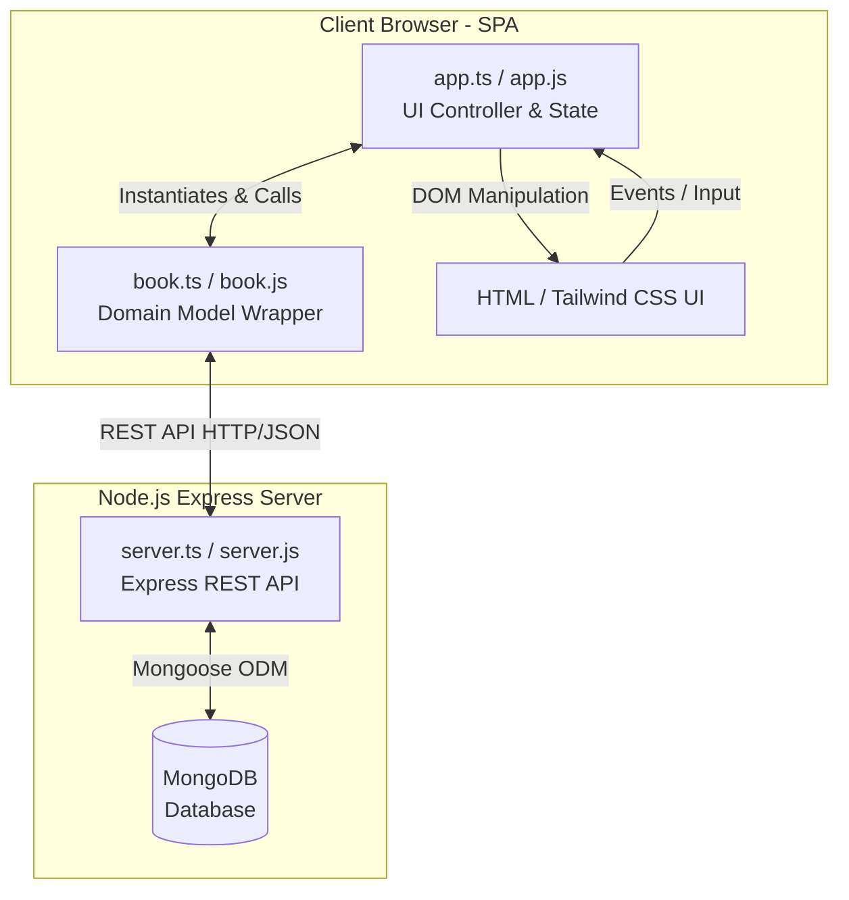
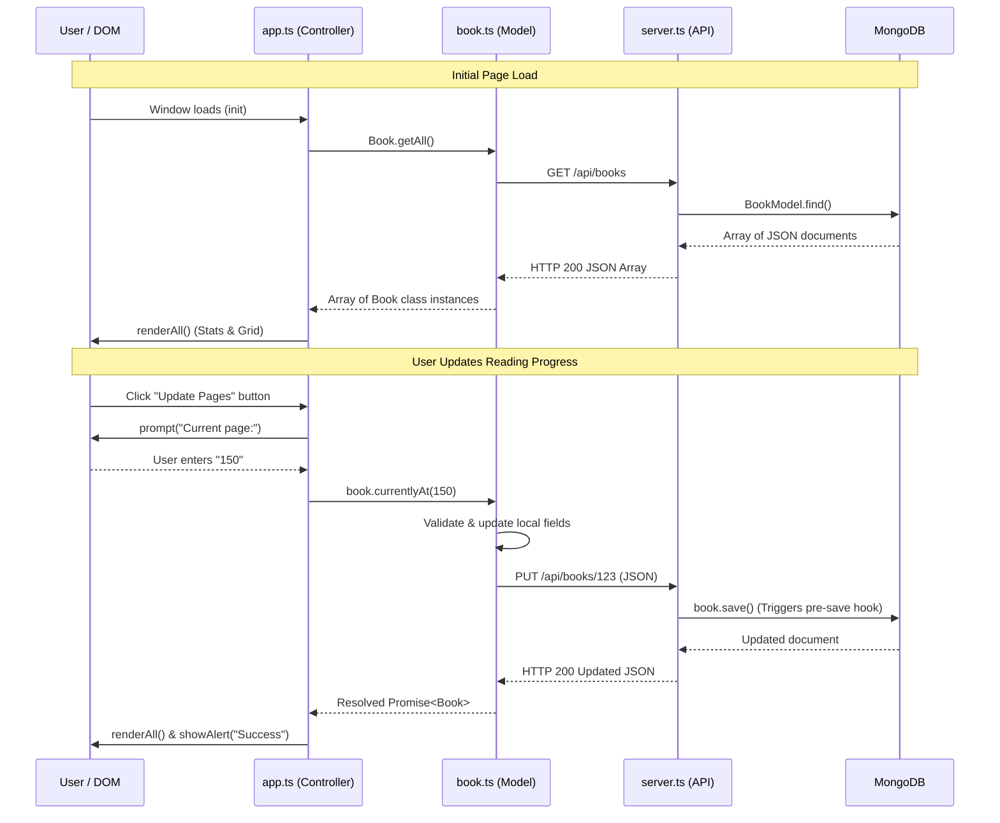

# 📚 Book Reading Tracker — Full-Stack Architecture & Deep Dive

This document provides a comprehensive, end-to-end explanation of how the Book Reading Tracker application operates. It breaks down the system into its three core pillars—Backend (`server.ts`), Domain Model (`book.ts`), and Frontend Controller (`app.ts`)—and explains how they communicate, maintain state, and enforce business rules.

---

## 🏛️ High-Level System Architecture

The application follows a classic **Single Page Application (SPA) Client-Server Architecture** augmented with **TypeScript** for end-to-end type safety.



### 📦 Project Structure & TypeScript Flow
Because Node.js (CommonJS) and browser environments (ES Modules) require different module systems, the project uses two separate TypeScript configurations:
1. **Server Build (`tsconfig.json`)**: Compiles `src/server.ts` to `dist/server.js` (CommonJS).
2. **Client Build (`tsconfig.client.json`)**: Compiles `client/app.ts` and `client/book.ts` to `public/js/app.js` and `public/js/book.js` (ES2020 Modules).
3. **Shared Types (`types.ts`)**: Defines common interfaces like `IBook`, `BookStatus`, and `BookFormat` to guarantee data consistency across the wire.

---

## 1️⃣ The Backend REST API (`src/server.ts`)

The backend is built with **Node.js, Express, and Mongoose**. Its primary responsibility is managing persistent storage in MongoDB, serving static frontend files, and enforcing data integrity rules before saving.

### 🗄️ Mongoose Schema & Data Integrity
The Mongoose schema (`bookSchema`) defines the exact structure of a document in MongoDB:
- **Enums**: `status` and `format` are strictly validated against allowed lists (`VALID_STATUSES` and `VALID_FORMATS`).
- **Required & Default Values**: `title`, `author`, `pages`, and `format` are required. `pagesRead` defaults to `0`.

```typescript
const bookSchema = new Schema<IBookDocument>({
  title:       { type: String, required: true, trim: true },
  author:      { type: String, required: true, trim: true },
  pages:       { type: Number, required: true, min: 1 },
  pagesRead:   { type: Number, default: 0, min: 0 },
  status:      { type: String, enum: VALID_STATUSES, default: 'Want to read', required: true },
  price:       { type: Number, default: 0, min: 0 },
  format:      { type: String, enum: VALID_FORMATS, required: true },
  suggestedBy: { type: String, default: '', trim: true },
  finished:    { type: Boolean, default: false },
}, { timestamps: true });
```

### ⚡ The Pre-Save Hook (Automated Business Logic)
A critical business rule is that `finished` must be automatically calculated based on `pagesRead` and `pages`. To ensure this rule is **never bypassed** (even if the frontend sends incorrect data), Mongoose uses a `pre('save')` middleware hook:

```typescript
bookSchema.pre('save', function (this: IBookDocument, next) {
  // 1. Clamp pagesRead so it never exceeds total pages
  if (this.pagesRead > this.pages) this.pagesRead = this.pages;
  // 2. Automatically compute 'finished' boolean
  this.finished = this.pages > 0 && this.pagesRead >= this.pages;
  next();
});
```

### 🌐 REST API Endpoints
Express provides 5 core REST endpoints under `/api/books`:
- `GET /api/books`: Fetches all books from MongoDB, sorted by `createdAt` descending (newest first).
- `GET /api/books/:id`: Fetches a single book document by its `_id`.
- `POST /api/books`: Validates and creates a new book document.
- `PUT /api/books/:id`: Updates an existing book. It filters incoming data using an `ALLOWED_FIELDS` array to prevent injection of unallowed properties (like modifying `_id` or manually forcing `finished`).
- `DELETE /api/books/:id`: Deletes a book document by its `_id`.

---

## 2️⃣ The Client Domain Model (`client/book.ts`)

On the client side, raw JSON data from the API is wrapped in an ES6/TypeScript class called `Book`. This pattern is called the **Active Record / Domain Model pattern**. It encapsulates data attributes and the methods required to mutate and persist them.

### 🧬 Class Structure & Instantiation
When `Book.getAll()` or `Book.create()` is called, the raw JSON object returned by the server is passed into the `Book` constructor:

```typescript
export class Book implements IBook {
  // Fields...
  constructor(data: IBook) {
    this._id         = data._id;
    this.title       = data.title;
    this.pages       = Number(data.pages);
    this.pagesRead   = Number(data.pagesRead) || 0;
    // ...
    this.finished    = this.pages > 0 && this.pagesRead >= this.pages;
  }
  // ...
}
```

### 🧮 Computed Properties
The class provides helper methods for UI display:
- `readingPercentage()`: Calculates `(pagesRead / pages) * 100`, rounded to one decimal place (e.g., `50.5%`). It handles division-by-zero safeguards.
- `getInfo()`: Strips class methods and returns a pure JS object (`IBookInfo`) containing all properties plus the `readingPercentage`.

### 🔄 Client-Server Synchronization (`_syncToServer`)
Whenever a book's state is modified via an instance method, the change is immediately sent to the backend via `PUT /api/books/:id`.
```typescript
private async _syncToServer(): Promise<Book> {
  const res = await fetch(`${API_BASE}/${this._id}`, {
    method: 'PUT',
    headers: { 'Content-Type': 'application/json' },
    body: JSON.stringify(this.getInfo()),
  });
  if (!res.ok) throw new Error(...);
  const updated = await res.json();
  Object.assign(this, new Book(updated)); // Update local instance with server response
  return this;
}
```

### 🛠️ Instance Action Methods
- `currentlyAt(pageNumber)`: Validates that `pageNumber` is between `0` and `pages`. Updates `pagesRead`, recalculates `finished`, and if `finished` is true, auto-promotes `status` to `'Read'`. Calls `_syncToServer()`.
- `updateStatus(newStatus)`: Validates against `Book.STATUSES`, updates `status`, and calls `_syncToServer()`.
- `update(fields)`: Merges an object of updated form fields into the instance and calls `_syncToServer()`.
- `deleteBook()`: Sends a `DELETE` HTTP request to remove the book from MongoDB.

---

## 3️⃣ The Frontend Controller (`client/app.ts`)

`app.ts` is the orchestrator of the frontend. It manages the local state, listens to user interactions (clicks, form submissions, filter changes), calls the `Book` domain model, and dynamically re-renders the DOM.

### 🧠 Local State Management
The app maintains four main state variables in memory:
```typescript
let books: Book[] = [];          // Master list of Book class instances
let filterStatus  = '';          // Current status filter (e.g., 'Currently reading')
let filterFormat  = '';          // Current format filter (e.g., 'Ebook')
let searchQuery   = '';          // Current search bar text
let editingId: string | null = null; // Tracks which book is open in the Edit Modal
```

### 🔄 The Application Lifecycle & Data Flow



### 🎨 Dynamic DOM Rendering & Filtering
Whenever state changes, `app.ts` re-renders the UI in a highly optimized sequence:
1. **`filteredBooks()`**: Takes the master `books` array and applies the search query (matching title or author), status filter, and format filter.
2. **`updateStats()`**: Calculates summary metrics from the master list:
   - `Total Books`: `books.length`
   - `Finished`: Count of books where `book.finished === true`
   - `Reading Now`: Count of books where `book.status === 'Currently reading'`
   - `Pages Read`: Sum of `book.pagesRead` across all books.
3. **`renderBooks()`**: Clears the `#books-grid`. If the filtered list is empty, it unhides `#empty-state`. Otherwise, it loops through the filtered books, calling `createCard(book)` and appending the generated DOM nodes.

### 🏷️ Component Generation (`createCard`)
`createCard(book)` dynamically constructs an HTML card representing a book. It utilizes helper functions to apply the **Literary Calm** design aesthetics:
- `statusColor(status)`: Returns Tailwind classes for beautiful, tinted pill badges based on the status (e.g., Mint for Read, Coral for DNF).
- `progressColor(pct)`: Returns gradient classes for the progress bar (Navy/Slate for low progress, Coral/Gold for medium, Mint/Emerald for 100%).
- `formatIcon(format)`: Returns an appropriate emoji/icon (`📖`, `📱`, `🎧`, `📄`).

### 🎛️ Event Delegation & Modal Handling
To keep event listeners clean and performant, `app.ts` uses **Event Delegation** on the `#books-grid` container:
- When a user clicks inside the grid, `handleCardActions(e)` checks `e.target.closest(...)` to determine if a Delete, Update Pages, Status, or Edit button was clicked.
- **Form Handling (`handleFormSubmit`): When the modal form is submitted, `app.ts` extracts values, checks if `editingId` is set (determining whether to call `book.update()` or `Book.create()`), updates the `books` array, closes the modal, and re-renders the UI.
- **Real-Time Validation**: Event listeners on the form inputs automatically clamp `pagesRead` so a user cannot type a number greater than `pages`.

---

## 🎯 Summary of Key Design Patterns
1. **RESTful API**: Clear separation of concerns between client and server using standard HTTP methods and JSON.
2. **Active Record (Domain Model)**: Encapsulating data and persistence logic inside the `Book` class.
3. **Single Source of Truth**: Mongoose pre-save hooks guarantee database integrity, while `app.ts` maintains a unified state array for the UI.
4. **Event Delegation**: Efficient DOM event handling attached to parent containers rather than individual card buttons.
